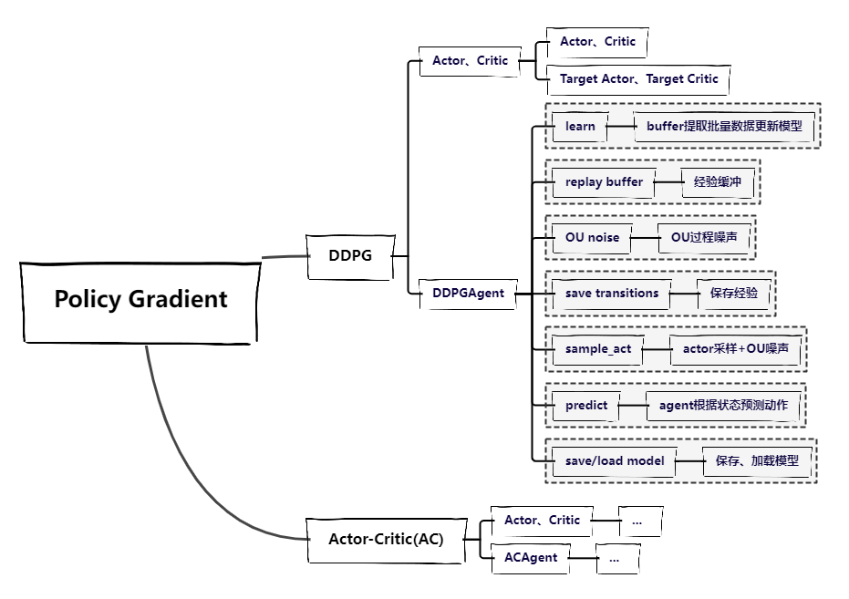
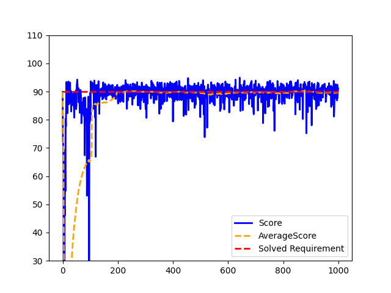
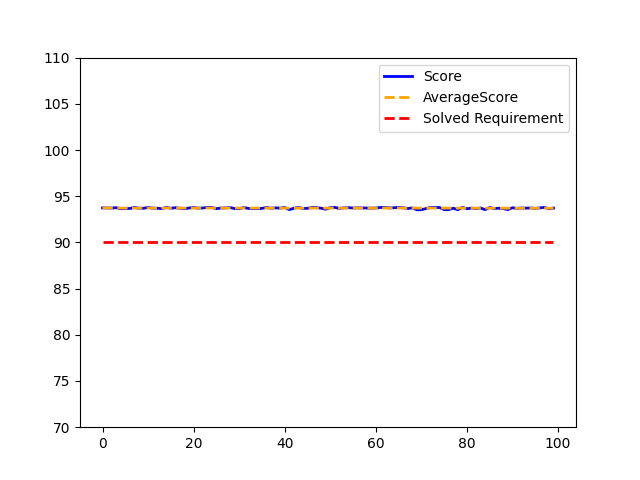
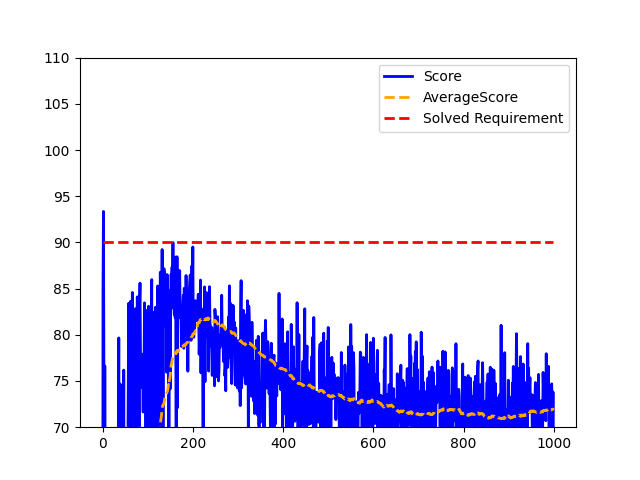
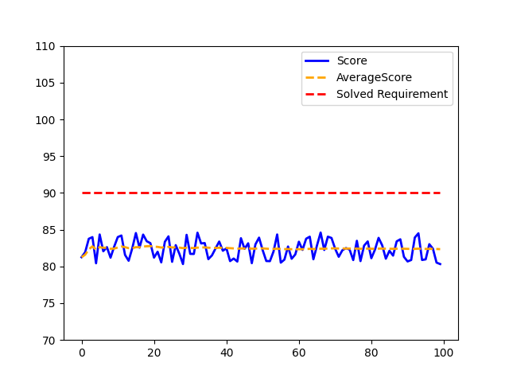

# Introduction

A simple implementation of deep deterministic policy gradient (DDPG) and Actor Critic (AC) with pytorch, both model-free,
off-policy algorithms for learning continous actions.

The original DDPG paper link: [《Continuous control with deep reinforcement learning》](https://arxiv.org/abs/1509.02971).

The original AC paper link: [《Actor-Critic Algorithms》](https://papers.nips.cc/paper/1786-actor-critic-algorithms.pdf).

The DDPG algorithm is implemented in the `ddpg` folder, and the environment
is [MountainCarContinuous-v0](https://gym.openai.com/envs/MountainCarContinuous-v0/), with the continuous state space of
2 and continuous action space of 1.

Actor-Critic algorithm is also implemented, which is in the `ac` folder, but it performs not very good, especially the
stability and Rate of convergence, and it's really hard to tune the parameters, so I don't recommend it.

# Structure

```
├── README.md
├── train.py: train the ddpg model, save model and plot the result
├── run.py: run the ddpg model, load model and plot the result
├── ddpg: 
│   ├── actor_critic.py: respective actor and critic network
│   ├── ddpg_agent.py: the ddpg agent, including the replay buffer, the training process...
├── ac: ...almost the same as ddpg
├── utils: some useful functions
├── result: the result of the experiment
...
```



# run

```
python train.py
python run.py
```

for `run.py`, you need to specify the model path in the code.

Also, `cuda` is supported, just change the `device` in the code.

And if you want to change the agent, just switch from `DDPGAgent` to `ACAgent`, I have implemented both of them with the
same interface.

For more details, please see the code.

# result

Available parameters:

| Parameter  | Description                                           |
|------------|-------------------------------------------------------|
| n_state    | Number of states in the environment                   |
| n_action   | Number of possible actions in the environment         |
| hidden1    | Dim of the hidden layer1 in the actor or critic       |
| hidden2    | Dim of the hidden layer2 in the actor or critic       |
| gamma      | Discount factor for updating Q-values                 |
| lr_actor   | Learning rate for the actor optimizer                 |
| lr_critic  | Learning rate for the critic optimizer                |
| batch_size | Number of samples to include in each training batch   |
| buf_size   | Maximum size of the experience buffer                 |
| sync_freq  | Number of steps between updates of the target network |
| exp_name   | Name of the experiment for tracking results           |

## DDPG

the `DDPG` baseline is set as:

|    parm    |  value  | 
|:----------:|:-------:| 
|  n_state   |    2    |
|  n_action  |    1    |
|  hidden1   |   256   |
|  hidden2   |   256   |
|   gamma    |  0.99   |
|  lr_actor  | 0.0001  |
| lr_critic  |  0.001  |
| batch_size |   64    |
|  buf_size  | 1000000 |
| sync_freq  |   100   |

Training result:



Testing result(100 episodes):



## AC

The `AC` baseline is set as:

|    parm    |  value  | 
|:----------:|:-------:| 
|  n_state   |    2    |
|  n_action  |    1    |
|  hidden1   |   256   |
|  hidden2   |   256   |
|   gamma    |  0.99   |
|  lr_actor  | 0.00001 |
| lr_critic  | 0.0001  |
| batch_size |   64    |
|  buf_size  | 1000000 |
| sync_freq  |   100   |

Training result:



Testing result(100 episodes):

